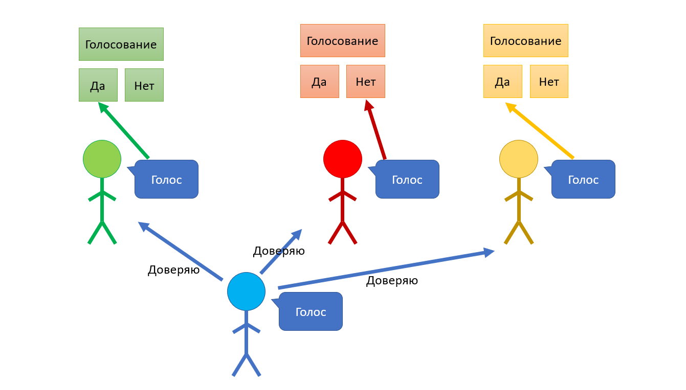
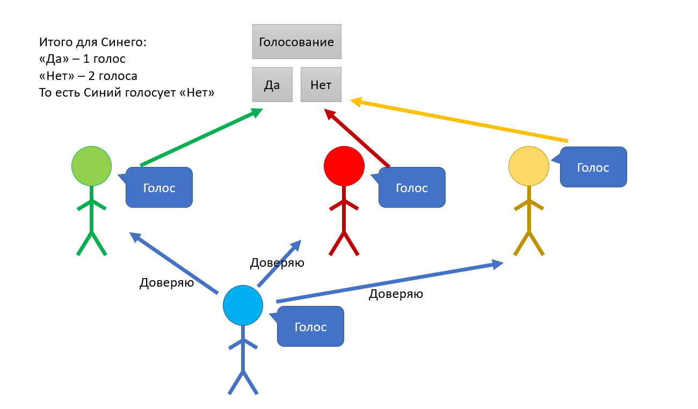
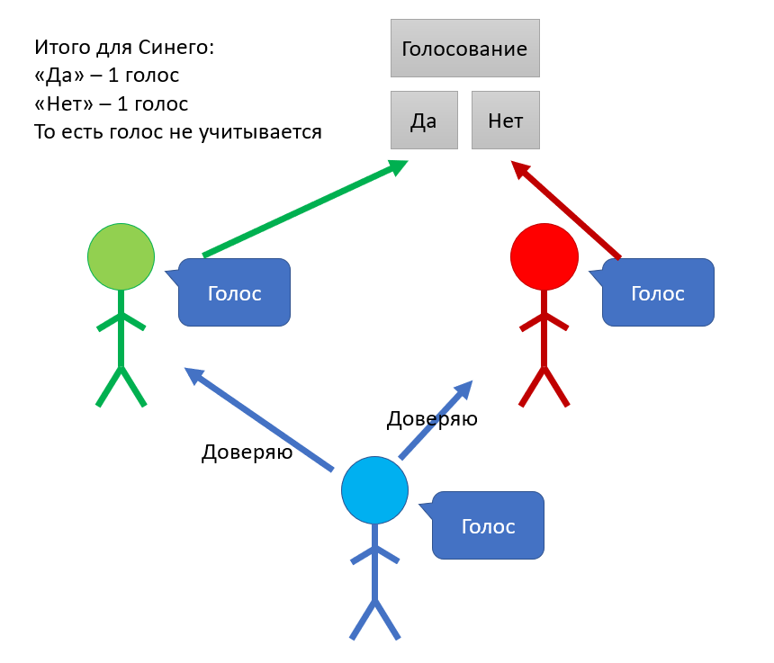
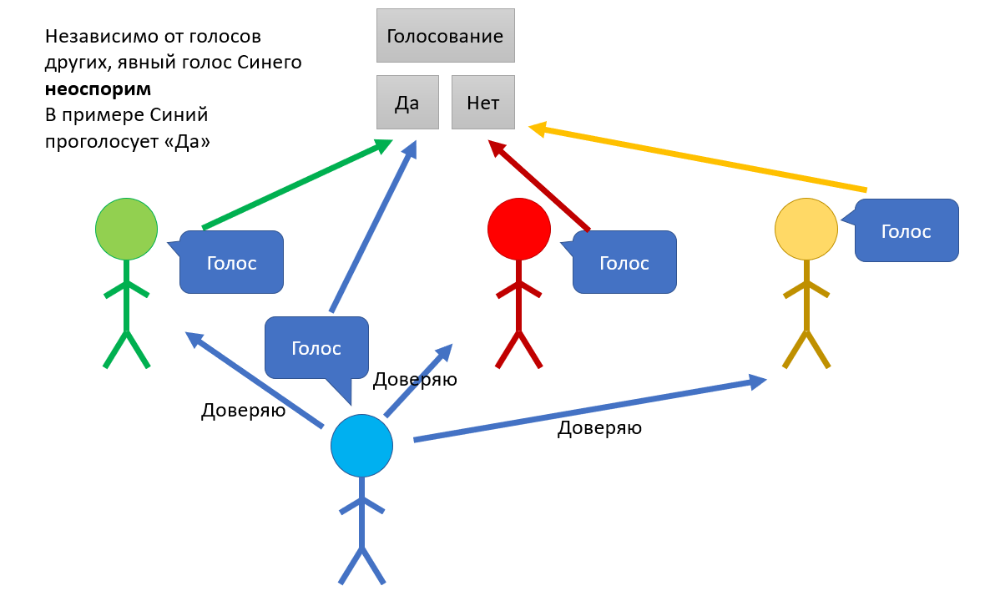
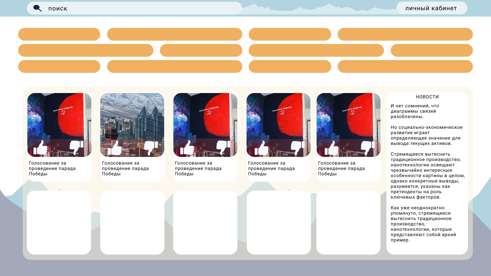
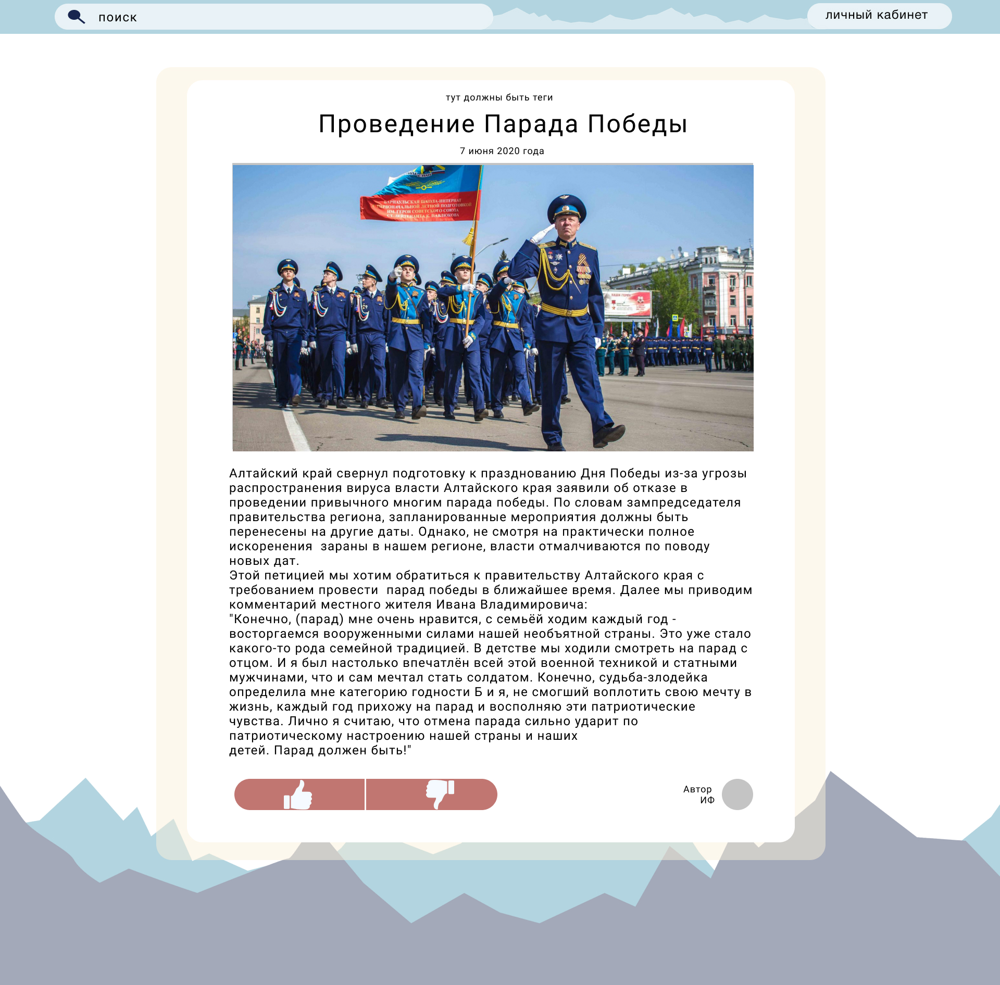
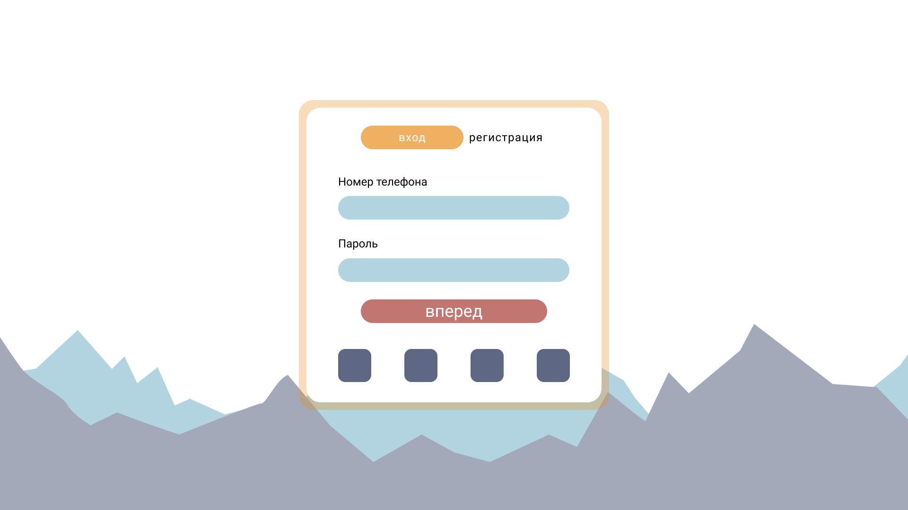

# Клуб Любителей Растений

Этот репозиторий создан для публикации решения по хакатону ["Цифровой прорыв"](https://leadersofdigital.ru/)

## Что мы предлагаем - Множественные лайки

Одной из идей нашего проекта было создание возможности передачи своего голоса нескольким людям.
Это удобно, когда хочется прислушиваться сразу к нескольким людям, которые продвигают интересные идеи.
 

Однако возникает вопрос, когда мысли людей, которым человек доверил свой голос, расходятся.
Мы считаем, что в этом случае, что человек будет склоняться к тому варианту, за который голосует большая часть людей из его круга доверия.
 

При всём при этом, человека можно назвать неопредилившимся, когда число голосов в противоположных вариантах совпадают.
Поэтому его голос при таком распределении голосов учитываться не будет.
 

Стоит отметить, что в случае, когда человек самостоятельно голосовал, то есть принял осознанное решение, вне зависимости от мнений из круга доверия, явный голос будет неоспорим.
 

В папке **MultipleLikesEmulation** расположено формальное описание работы предложенной идеи, а так же
принцип взаимодействия разных компонентов системы друг с другом на языке c++.

## Что мы предлагаем - Удобный сайт

Для привлечения внимания граждан к принятию решений, связанных с жизнью региона, мы предлагаем удобный сайт, дизайн которого будет интуитивно понятен как для молодёжи, так и для людей в возрасте.

Ниже приведены примеры главной страницы, страницы с голосованием, личного кабинета и страницы с авторизацией.
 
 
 
 
