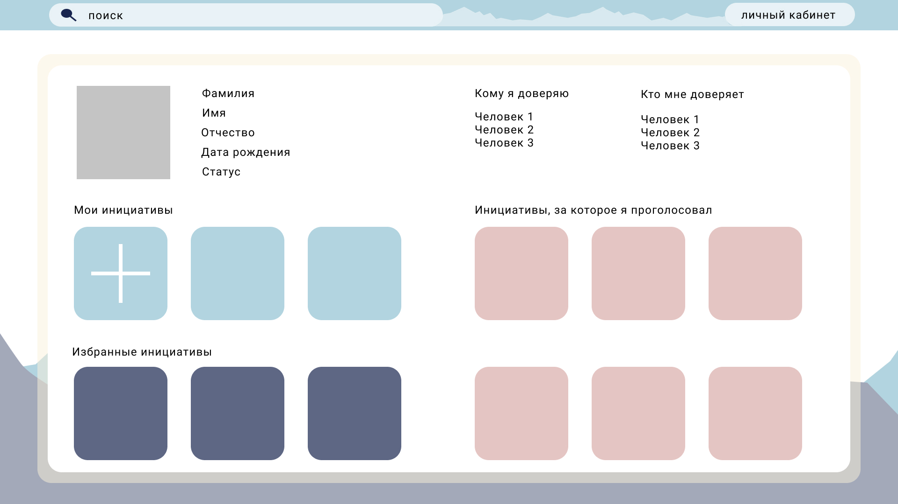

#  луб Ћюбителей –астений

Ётот репозиторий создан дл€ публикации решени€ по хакатону ["÷ифровой прорыв"](https://leadersofdigital.ru/)

## „то мы предлагаем - ћножественные лайки

ќдной из идей нашего проекта было создание возможности передачи своего голоса нескольким люд€м.
Ёто удобоно, когда хочетс€ прислушиватьс€ сразу к нескольким люд€м, которые продвигают интересные идеи.
 

ќднако возникает вопрос, когда мысли людей, которым человек доверил свой голос, расход€тс€.
ћы считаем, что в этом случае, что человек будет склон€тьс€ к тому варианту, за который голосует больша€ часть людей из его круга довери€.
 

ѕри всЄм при этом, человека можно назвать неопредилившимс€, когда число голосов в противополножных вариантах совпадают.
ѕоэтому его голос при таком распределении голосов учитыватьс€ не будет.
 

—тоит отметить, что в случае, когда человек самосто€тельно голосовал, то есть прин€л осознанное решение, вне зависимости от мнений из круга довери€, €вный голос будет неоспорим.
 

¬ папке **MultipleLikesEmulation** расположено формальное описание работы предложенной идеи, а так же
принцип взаимодействи€ разных компонентов системы друг с другом на €зыке c++.

## „то мы предлагаем - ”добный сайт

ƒл€ привлечени€ внимани€ граждан к прин€тию решений, св€занных с жизнью региона, мы предлагаем удобный сайт, дизайн которого будет интуитивно пон€тен как дл€ молодЄжи, так и дл€ людей в возрасте.

Ќиже приведены примеры главной страницы, страницы с голосованием, личного кабинета и страницы с авторизацией.
 
 
 
 
